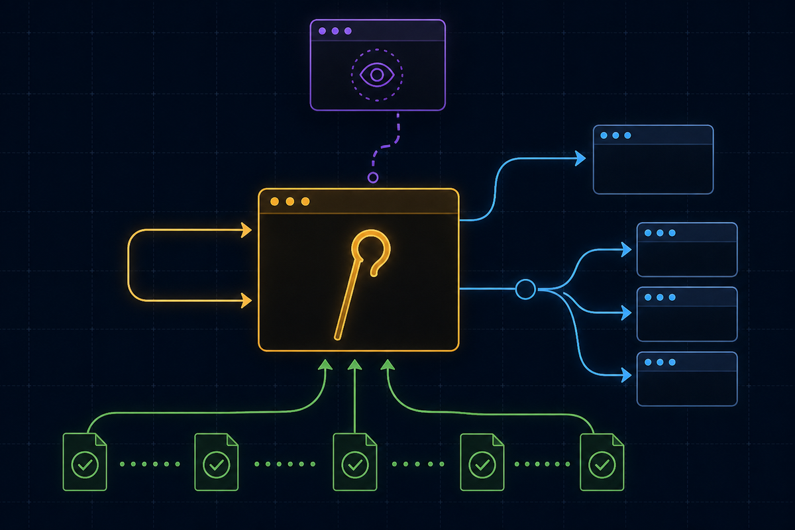
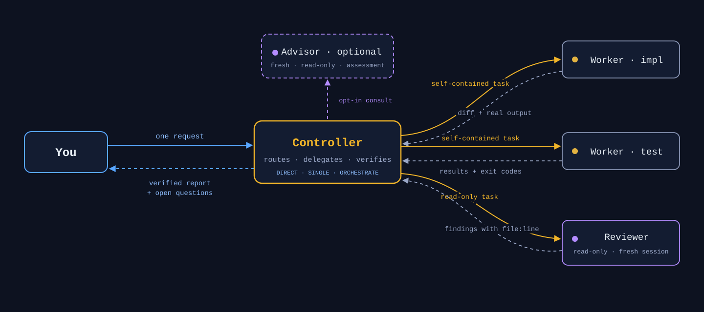

<p align="center">
  
</p>

<h1 align="center">hod — Herdr Orchestrator Driver</h1>

<p align="center">
  <strong>One command in. One accountable controller. A herd of coding agents, verified.</strong>
</p>

<p align="center">
  <b>English</b> · <a href="README.vi.md">Tiếng Việt</a>
</p>

<p align="center">
  <!-- CI badge hidden while automatic validation is paused. -->
  <a href="https://github.com/hapo-nghialuu/hod/releases"></a>
  
  <a href="LICENSE"></a>
</p>

<p align="center">
  <a href="#-get-started"><b>🚀 Get started</b></a> ·
  <a href="#what-is-this">What is this?</a> ·
  <a href="#how-it-works">How it works</a> ·
  <a href="#the-hod-command">Commands</a> ·
  <a href="#appendix">Appendix</a>
</p>

---

# 🚀 Get started

**Three steps. About five minutes.**

### 1 · Prerequisites

macOS or Linux, plus:

| Need | Get it |
| --- | --- |
| [Herdr](https://herdr.dev/) | `brew install herdr` |
| `git`, `jq` | `brew install jq` (git usually present) |
| One agent CLI, logged in | `claude`, `codex`, or `grok` — one is enough |

### 2 · Install `hod`

```bash
curl -fsSL https://raw.githubusercontent.com/hapo-nghialuu/hod/main/install.sh | sh
hod status
```

<details>
<summary>Pin a release instead of tracking <code>main</code> — recommended for teams</summary>

```bash
curl -fsSL https://raw.githubusercontent.com/hapo-nghialuu/hod/main/install.sh | HOD_REF=v0.1.14 sh
```

</details>

That is the whole setup: nothing to rearrange, no per-project ceremony. `hod`
clones the skill into `~/.hod/skill/`, puts the `hod` executable on
`~/.local/bin/`, and links global adapters so every agent CLI can find it.
Attach a single project instead with `hod install --project /path/to/repo`.

Recommended next: install the matching Herdr integration for each CLI you
actually run — `herdr integration install claude`, `herdr integration install
codex`, or `herdr integration install grok`. The right integration makes agent
state and session identity authoritative in the sidebar rather than guessed;
install one per CLI you use, and only for the ones you use.

**Integrations vs plugins.** Herdr *integrations* are the connectors above —
they give the sidebar authoritative per-CLI agent state and session identity.
Herdr *plugins* are a separate, optional extension surface: third-party
actions, event hooks, and plugin panes. hod never requires a plugin. See
[Herdr integrations](https://herdr.dev/docs/integrations/) and
[Herdr plugin APIs](https://herdr.dev/docs/socket-api/#plugin-apis).

### 3 · Run your first orchestrated task

```bash
cd /path/to/your/project
herdr                 # Herdr opens
claude                # inside the pane — this is your controller
```

Paste this, naming **Herdr** and **herdr-orchestrator** — without both names
the skill stays dormant:

```text
Use Herdr and the herdr-orchestrator skill to <a small, verifiable task>.
One writer, one read-only reviewer. Do not commit or push.
Return changed files, real test results, and unresolved questions.
```

<details>
<summary>Other ways to invoke it, per CLI</summary>

| CLI | Invocation | Notes |
| --- | --- | --- |
| Claude Code | `/herdr-orchestrator` | Slash command; loads the skill up front, then describe the task |
| Codex | `$herdr-orchestrator` | Same idea with Codex's prefix |
| Grok Build | plain request | Ask explicitly to use the `herdr-orchestrator` skill |
| Any | naming it in the request | The example above — works everywhere, no prefix needed |

Loading the skill by command and describing the task in plain words reach the
same place. The prefix forms save you from repeating the skill name; the plain
request is one less thing to remember. Either way the task itself still needs
the outcome, the roles, and what evidence you expect back.

</details>

> ✅ **It is working when new panes appear in the Herdr sidebar.**
> Status dots: 🟡 working (leave it alone) · 🔴 blocked (it needs you — read
> that pane, but answer in the controller's pane) · 🟢 idle.
> Detach any time with `ctrl+b` then `q`; nothing dies.

**Need more detail?** [Quickstart — five levels](docs/quickstart.md) ·
[Getting started — six checked steps](docs/getting-started.md) ·
[Troubleshooting](docs/troubleshooting.md)

---

## What is this?

Running several AI coding agents at once is easy. Keeping track of them is
not — you end up with a dozen terminal tabs, no idea which agent is waiting on
you, and no way to tell whether "done" actually means the code works.

`hod` gives you **one agent to talk to**. You describe what you want; it plans
the work, hands pieces to other agents in their own [Herdr](https://herdr.dev/)
panes, checks their output against real diffs and real test runs, and comes
back with one answer — plus a list of anything only you can decide.

<p align="center">
  
</p>

You never manage the workers. You never chase a pane. You get evidence, not
promises.

**Good fit if you** run more than one coding agent, want a second pair of eyes
on generated code, or need work split across projects without losing track of
who changed what.

> Independent community project. Not affiliated with Herdr, OpenAI, Anthropic, or xAI.

## Under the hood

`hod` ships as two deliberately separate parts:

| Part | What it is | What it does |
| --- | --- | --- |
| **The skill** | Markdown contract (`SKILL.md` + `references/`) | The brain: delegation rules, lifecycle discipline, verification, safety boundaries. Read by the LLM, enforced by its judgment |
| **The `hod` CLI** | A single bash binary | The hands: installs the skill anywhere, diagnoses the setup, manages role permission profiles. Contains **zero** orchestration logic |

This split is intentional: *code does the mechanical work, the LLM does the
judgment work* — and neither pretends to do the other's job.

## How it works

1. **You speak to one agent.** Inside a Herdr pane, name the skill explicitly:

   ```text
   Use Herdr and the herdr-orchestrator skill to implement the health
   endpoint. One writer, one read-only reviewer. Do not commit or push.
   Return changed files, test results, and unresolved questions.
   ```

2. **The controller runs a preflight** — refuses to act unless it is inside a
   Herdr-managed pane (`HERDR_ENV=1`), the server is compatible, and the
   installed command family matches `--help` exactly. Anything ambiguous
   fails closed.

3. **Workers are addressed as if you wrote the prompt.** Herdr input carries
   no sender field, so wording is the only thing that leaks routing — the
   contract forbids "you are a sub-agent, report to the parent" framing
   entirely.

4. **Nothing is believed, everything is verified.** An agent's `done` state
   is a screen heuristic, not proof. The controller reads real diffs, runs
   checks in panes with per-run sentinels (so stale `passed` text can never
   be mistaken for fresh evidence), and sends material changes to an
   independent reviewer in a fresh session.

5. **The report ends with what still needs you** — every worker's open
   questions are harvested and attributed, never swallowed by the summary.

**You know it is working when new panes appear in the Herdr sidebar.** If you
only see "background agents" messages and the sidebar stays still, the CLI is
using its internal sub-agents, not Herdr orchestration — restate the request
naming Herdr and the skill.

## Adaptive coordinator (opt-in)

The default workflow remains unchanged unless you explicitly ask for an
adaptive coordinator or coordinator plus advisor. Adaptive mode chooses the
smallest route that fits the request:

| Base mode | Use it for | What happens |
| --- | --- | --- |
| `DIRECT` | Questions, explanations, read-only inspection, and status | A no-plan fast path; no worker or checkpoint |
| `SINGLE` | One reversible outcome with one narrow owner | One task packet and mechanical evidence for a repository change |
| `ORCHESTRATE` | Multiple writers, dependencies, phases, repositories, or large blast radius | A working plan, explicit ownership, and ordered coordination |

`CONSULT` and `ASK_USER` are overlays, not additional modes. Within adaptive
mode, a consult opens a fresh independent advisor when you explicitly request
one or a qualifying technical trigger fires; an authority, permission, cost,
or external-action question pauses for you.
Choose the advisor from `Fable`, `GPT-5.6 Sol`, or `Opus` — the advisor gives an
assessment, never approval. Every repository change still gets a mechanical
E0 evidence receipt before acceptance, and every tripwire holds before
re-routing.

See the [adaptive coordinator reference](references/coordinator-advisor.md) for
the complete protocol and [usage examples](docs/usage-guide.md).

## The `hod` command

| Command | What it does |
| --- | --- |
| `hod install` | Clone/update the skill and link global adapters (`~/.claude/skills/`, `~/.agents/skills/`) |
| `hod install --project <path>` | Attach one project instead — any location, any directory name. Git is optional; outside a repository the `.git/info/exclude` step is skipped. Also writes the reminder block (`--no-memo` skips it) |
| `hod install --ref <tag>` | Pin the skill to a release tag |
| `hod status` | ✓/✗ one-liners: prerequisites, agent CLIs, checkout, adapters, PATH. Exit 0 when healthy |
| `hod doctor` | Everything `status` checks plus remediation commands, adapter resolution, checkout mode (branch vs pinned), integration status |
| `hod update` | Fast-forward the skill; a pinned checkout moves to the newest tag. Refuses a dirty tree |
| `hod settings list` | Show Claude role profiles and equivalent Codex flags; Grok uses its native flags — no templates printed |
| `hod settings install [--role <r>] [--force]` | Write role profiles into a project's `.claude/` |
| `hod ui [--project <path>] [--port <0-65535>] [--no-open]` | Launch the local HOD web console (Node.js 20+) |
| `hod uninstall [--purge]` | Remove only adapters that resolve into `~/.hod/skill`, and strip the reminder block; never touches foreign files |

The non-UI `hod` checks against Herdr are **read-only** (`herdr status`,
`herdr integration status`). `hod` never starts agents or installs
integrations. The local UI reads the runtime and can change only the documented
settings after your explicit confirmation — session authority stays with you
and the controller.

## The local HOD UI console

The UI is an optional local web console for watching Herdr workspaces and
agents without managing panes by hand:

```bash
hod ui [--project <path>] [--port <0-65535>] [--no-open]
```

For the directory-independent, runtime-only observer, use:

```bash
hod start [--port <0-65535>] [--no-open]
```

`hod start --project <path>` is rejected; the observer ignores the current
directory. Its Settings view selects a live Herdr project/space by opaque
workspace ID; the server resolves the current authoritative checkout and never
exposes project paths to the browser. `hod ui` and `hod ui --project` keep their
existing project-scoped behavior unchanged.

It supports macOS and Linux and requires Node.js 20 or newer. The default port
is `0` (an OS-selected free port), and the default browser opener is `open` on
macOS or `xdg-open` on Linux. `--no-open`, or a failed opener, prints a recovery
URL. Treat its one-time `#token` fragment as sensitive: never share or log it;
the browser exchanges it for a local `HttpOnly; SameSite=Strict` cookie and
clears the fragment.

The console is local-only (`127.0.0.1` with strict `Host`/`Origin` checks and no
remote/LAN mode). Its Runtime view tracks multiple Herdr workspaces/spaces and
agents using bounded polling, not event-driven Herdr subscriptions; Herdr
outages are nonfatal and reconnect clears stale state. The dashboard reports
all-space totals for spaces, agents, working, blocked, idle, and done, regardless
of the selected space. Transcript output is only the selected pane's RAM-only,
capped 16 MiB UTF-8 tail, read-only and not persistent, byte-exact, append-only,
or an audit log. In `hod start`, Settings can install the documented three HOD
role profiles for the selected live project and update exactly ten typed,
allowlisted global Herdr keys after confirmation. Missing or ambiguous project
roots fail closed; unknown and secret keys stay hidden. Runtime-only mode still
exposes no agent-control actions.

The complete console behavior, settings matrix, write checks, and residual
same-user path-swap limitation are documented in [Local HOD UI console](docs/usage-guide.md#local-hod-ui-console).

## The reminder block

Models forget mid-session that Herdr orchestration is available. A project
install writes a few lines into `CLAUDE.md` and `AGENTS.md` — the files agent
CLIs read on every turn — so the controller is reminded to delegate rather than
do the work itself:

```markdown
<!-- hod:begin — managed by hod; edits inside this block are overwritten -->
## Herdr orchestration
...
<!-- hod:end -->
```

The markers make it safe to re-run: only the block between them is replaced,
everything you wrote outside is preserved byte-for-byte, and `hod uninstall
--project` removes it again. hod refuses to touch a file with unbalanced
markers or one that is a symlink.

These files usually belong to the repository, so the block shows up in `git
status` — **review the diff and decide whether to commit**; hod never commits.
Skip the block entirely with `hod install --project <path> --no-memo`.

The block comes in two variants. The default reminds the agent to orchestrate
when you ask for work split across agents. `--memo-strict` declares a
**Herdr-first project**: inside a Herdr pane, every implementation, bug-fix,
or multi-step task routes through Herdr workers, and the controller works
directly only for questions or small edits you ask for. Outside a Herdr pane
the preference never blocks work — the agent proceeds normally and just says
once that the project prefers Herdr. A plain re-install keeps
whichever variant the project already carries — teammates running `hod
install --project` cannot accidentally downgrade it — and `--memo-default`
switches back explicitly.

The block cannot force the skill to load: activation still requires you to name
Herdr or the skill in your request. It reminds, it does not override.

## Role profiles: rules the harness enforces

A role written in a prompt is advice. A role installed as a permission profile
is a boundary the agent cannot cross, even if asked to:

Claude enforces these profiles through settings files. Codex workers use native
sandbox and approval flags; exact mappings and honest gaps live in [Role
Boundaries](references/role-boundaries.md).

```bash
hod settings install          # writes .claude/settings.<role>.json + git-excludes them
```

| Role | Mode | Denied | Meaning |
| --- | --- | --- | --- |
| `controller` | `default` | `Edit` `Write` `NotebookEdit` `Agent` + `git push/merge` | Plans and delegates. Cannot edit files, and cannot spawn in-process sub-agents that would bypass Herdr |
| `impl` | `acceptEdits` | `git push` `merge` `reset --hard` `tag` | Writes code freely without a prompt per file; cannot publish |
| `reviewer` | `default` | edit tools + `Agent` + writing git commands + `rm` | Genuinely read-only, and reviews with its own eyes |

Denying a whole tool is airtight — the harness removes it from the model's
context. Denying a shell prefix is not: it matches the first token only, so
`Bash(pytest:*)` leaves `python -m pytest` open. These profiles therefore rely
on tool denies and leave command discipline to the task prompt and the evidence
the controller reads back.

`Agent` is the rule that keeps orchestration honest. Without it a controller
quietly falls back to its CLI's own sub-agents: no pane appears in the sidebar,
you cannot open or answer them, and their full transcripts land in the
controller's context until the run dies of context exhaustion.

Each profile also pins its own `defaultMode`, because a `--settings` file
outranks your `~/.claude/settings.json`. That matters if your machine uses
`dontAsk`: that mode auto-denies every tool absent from `permissions.allow`
**and** denies `AskUserQuestion` even when allowed — so a worker loses `Bash`
and can no longer report itself blocked. The pane stays silent and the
controller waits forever. Never put `dontAsk` in a role profile.

```bash
herdr agent start impl --kind claude --pane "$p" \
  -- --continue --settings .claude/settings.impl.json

herdr agent start reviewer --kind claude --pane "$p2" \
  -- --settings .claude/settings.reviewer.json     # fresh session, never --continue
```

Two rules proven by live testing, not theory:

- **Never combine a profile with `--dangerously-skip-permissions`** — that
  flag overrides every deny rule and the profile stops enforcing anything.
- **A reviewer is never a resumed session.** `--continue`/`--resume` restores
  exactly the bias an independent review exists to remove.

Profiles carry permission boundaries only — never credentials. Claude Code
merges them over the settings it already loads, so tokens, endpoints, and
hooks are inherited untouched. (Codex and Grok enforce roles through their own
flags — sandbox/approval modes and allow/deny rules; see the roles table in
[`SKILL.md`](SKILL.md).)

## What the skill guarantees

The contract the controller operates under, distilled:

- **Direct-user voice** — workers believe they are talking to you; internal
  routing never leaks into prompts.
- **Your authority is never invented** — no fabricated approvals; scope,
  risk, cost, and anything externally visible comes back to you. Delegation
  is never used to obtain authority you did not grant.
- **Fail-closed** — unknown command families, malformed JSON, ambiguous
  targets: stop and report, never guess pane IDs or syntax.
- **Evidence over claims** — verbal `done` is not completion; diffs, fresh
  sentinel-guarded check output, and independent review are.
- **One file, one writer** — parallel workers own disjoint paths; shared
  manifests get a single integration owner; conflicts go to a named
  integrator, never the controller's own hands.
- **Conservative cleanup** — panes and worktrees the task created stay
  available for your inspection until you authorize removal.

Every invariant lives in [`SKILL.md`](SKILL.md) itself — loaded whole whenever
the skill activates — plus references loaded only when needed:

| Reference | Covers |
| --- | --- |
| [Operations](references/operations.md) | Command recipes, stalled-prompt recovery, sentinels, task packets, session revival, integration checklists |
| [Adaptive coordinator](references/coordinator-advisor.md) | Opt-in routing, tripwires, evidence gates, advisor policy, and handoff checkpoints |
| [Portfolio hierarchy](references/portfolio-hierarchy.md) | One orchestrator, many projects: tiers, policies, persistent state |
| [Legacy Herdr 0.7.1](references/legacy-herdr-0.7.1.md) | Compatibility path for the old command family |

## Scaling up

- **Parallel work without collisions** — put independent tasks in separate
  Git worktrees (`herdr worktree create`), one agent per worktree; ownership
  stays disjoint even across checkouts.
- **Mixed teams** — `--kind claude|codex|grok` per worker, models passed
  through the `--` separator with exact IDs (`-m gpt-5.6-sol
  -c model_reasoning_effort=max`, `-m grok-4.5`, `--model <id>`).
- **Many projects, one orchestrator** — the opt-in
  [portfolio mode](docs/portfolio-orchestration.md): one controller per
  project workspace, a strict two-level delegation cap, and user-authored
  policy files stored *outside* every checkout so no agent can widen its own
  authority.

## Documentation

| Guide | For |
| --- | --- |
| [Quickstart — five levels](docs/quickstart.md) | Start in 2 minutes; climb only when a level feels limiting |
| [Getting started](docs/getting-started.md) | Full setup detail |
| [Local HOD UI console](docs/usage-guide.md#local-hod-ui-console) | Local runtime dashboard, transcript limits, settings, and security boundary |
| [Usage guide](docs/usage-guide.md) | Prompt recipes: pipelines, parallel teams, steering, model selection |
| [Portfolio orchestration](docs/portfolio-orchestration.md) | Managing several projects with one orchestrator |
| [Troubleshooting](docs/troubleshooting.md) | Adapters, preflight, capability mismatches |

## Repository structure

```text
herdr-orchestrator/
├── SKILL.md                    # agent-facing entry point (always loaded)
├── references/                 # detailed contracts (loaded on demand)
├── bin/hod                     # the CLI — install, doctor, settings, update
├── install.sh                  # curl | sh bootstrap (HOD_REF pins a version)
├── scripts/
│   ├── test-hod.sh             # 142 hermetic CLI tests
│   └── validate.sh             # syntax + frontmatter + markdown links
├── templates/                  # policy template + role permission profiles
├── docs/                       # human guides
├── assets/                     # README artwork
└── .github/workflows/          # Manual validation on Ubuntu + macOS; auto-run paused
```

## What it does not do

- Install, authenticate, or pay for agent CLIs.
- Grant permissions you did not already provide.
- Force every task into multi-agent mode — small tasks stay single-agent.
- Treat an agent's `done` state as proof of correctness.
- Commit, merge, push, publish, or delete anything without your authority.

## Known limitations

- Worker-role enforcement via settings profiles covers Claude Code; Codex and
  Grok use their own native flags (documented, not templated).
- Capability detection reads installed `--help` output — a future Herdr that
  rewords its help fails closed (safely) until the skill is updated.
- Herdr is pre-1.0; this project tracks current stable (tested against 0.8.0)
  with a best-effort legacy path for 0.7.1.
- Native Windows is untested.

## Appendix

<details>
<summary><b>A. Glossary — the words this project uses</b></summary>

| Term | Meaning |
| --- | --- |
| **Herdr** | The terminal multiplexer everything runs inside. It gives each agent a real pane, detects its state, and exposes a control API. Not part of this project |
| **Pane** | One terminal window inside Herdr. One interactive agent per pane |
| **Workspace** | A group of tabs and panes, normally one per project |
| **Controller** | The one agent you talk to. Plans, delegates, verifies, reports. Writes no code |
| **Worker** | An agent the controller hires for one scoped task. Starts with an empty context |
| **Reviewer** | A read-only worker that inspects a diff. Always a fresh session — never the agent that wrote the code |
| **Kind** | Which CLI an agent is: `claude`, `codex`, `grok`, … |
| **Adapter** | The symlink that makes the skill visible to a CLI (`~/.claude/skills/herdr-orchestrator`) |
| **Profile** | A settings file that removes tools from a worker, enforcing its role at the harness level |
| **Sentinel** | A unique token printed after a command so old text on screen can never be mistaken for a fresh result |
| **Ledger** | The controller's internal record of who owns which files, and each worker's state |
| **Preflight** | The checks the controller runs before touching anything: right environment, compatible server, known commands |

</details>

<details>
<summary><b>B. Command cheat sheet</b></summary>

**Setup and health**

```bash
hod status                         # is everything wired up?
hod doctor                         # same, plus the fix for each problem
hod update                         # pull the newest skill (or newest tag if pinned)
hod install --project <path>       # attach one project (+ reminder block)
hod install --project <path> --no-memo   # attach without touching CLAUDE.md
hod settings install               # write role profiles into a project
hod uninstall [--purge]            # remove hod-managed links only
```

**Herdr, day to day**

```bash
herdr                              # open or reattach the session
herdr agent list                   # every live agent and its state
herdr worktree create --cwd <repo> --branch <name> --no-focus
herdr integration status           # is agent-state detection authoritative?
```

Detach with `ctrl+b` then `q`. Nothing stops running.

**Starting a worker by hand** (the controller normally does this for you)

```bash
split=$(herdr pane split --current --direction right --cwd "$PWD" --no-focus)
pane=$(printf '%s\n' "$split" | jq -er '.result.pane.pane_id')
herdr agent start impl --kind claude --pane "$pane" \
  -- --settings .claude/settings.impl.json
```

</details>

<details>
<summary><b>C. Prompt patterns that work</b></summary>

**One task, verified** — the everyday default:

```text
Use Herdr and the herdr-orchestrator skill to <outcome>.
One writer, one read-only reviewer. Do not commit or push.
Return changed files, real test results, and unresolved questions.
```

**Strict coordinator-only** — when you want the controller to touch nothing:

```text
Run coordinator-only: do not create or edit any file yourself. Delegate every
change to a worker, verify its diff and checks, and ask me when a change seems
too small to be worth a worker.
```

**Parallel, non-colliding work** — only when the pieces truly do not overlap:

```text
Run these in parallel, one worker each, with disjoint file ownership:
- <task A> owns <paths>
- <task B> owns <paths>
Nobody touches shared manifests; assign those to a single integrator.
```

**Choosing kinds and models explicitly:**

```text
Planner: codex, started with -m <id> -c model_reasoning_effort=max
Implementer: grok, started with -m <id>
Reviewer: claude, started with --settings .claude/settings.reviewer.json
If a CLI rejects a model, stop and ask me — do not substitute another.
```

**Steering mid-flight:**

```text
Prioritise the production bug and pause the feature work.
```

```text
The test failed on Ubuntu with this output: <evidence>. Re-read the affected
files, fix only the demonstrated regression, and rerun the test.
```

</details>

<details>
<summary><b>D. Reading the sidebar</b></summary>

| Dot | State | What it means | What you do |
| --- | --- | --- | --- |
| 🟡 | `working` | The agent is mid-turn | Nothing. Do not send another prompt — Herdr does not track turns, so it may answer the wrong request |
| 🔴 | `blocked` | Herdr saw an approval or question prompt | Open the pane to **read** it, then answer in the **controller's** pane |
| 🔵 | `done` | Finished, nobody has looked yet | Nothing — the controller harvests it. `done` is not proof the work is correct |
| 🟢 | `idle` | Free and waiting | Nothing |
| ⚪ | `unknown` | Herdr cannot classify it | Never assume success; the controller runs `herdr agent explain` |

**The litmus test:** real orchestration makes **new panes appear**. If a CLI
reports "background agents" while the sidebar stays still, it is using its own
internal sub-agents — no Herdr involved.

</details>

<details>
<summary><b>E. When something goes wrong</b></summary>

| Symptom | Likely cause | Fix |
| --- | --- | --- |
| "requires a Herdr-managed pane" | You started the CLI outside Herdr | Run `herdr` first, start the agent inside a pane |
| Skill never activates | The request did not name it | Say both "Herdr" and "herdr-orchestrator" |
| Sidebar shows no state for an agent | No integration installed for that kind | `herdr integration install <kind>` — e.g. `herdr integration install grok`. Install only the ones matching CLIs you use |
| `hod: command not found` | `~/.local/bin` is not on `PATH` | Add the export line `hod` printed, open a new terminal |
| A role profile is not enforcing | `--dangerously-skip-permissions` was also passed | Drop that flag — it overrides every deny rule |
| Worker seems stuck | It may be blocked, not dead | Read its pane; if it is waiting on a decision, answer through the controller |
| `hod update` refuses | The skill checkout has local edits | `cd ~/.hod/skill && git status`, then commit, stash, or discard |

Start with `hod doctor` — it names the problem and the command that fixes it.
Full guide: [Troubleshooting](docs/troubleshooting.md). Never restart the Herdr
server to "clear" a problem; it kills work that is still running.

</details>

<details>
<summary><b>F. Safety boundaries, in one place</b></summary>

Things that **never** happen without your say-so:

- Commit, push, merge, tag, publish, deploy
- Deleting files, worktrees, branches, panes, or sessions the task did not create
- Installing Herdr integrations or plugins, changing configuration, updating Herdr
- Using credentials, making purchases, or any externally visible action
- Widening a worker's permissions, or using delegation to obtain authority you did not grant

Things that are **structurally** prevented, not merely discouraged:

- Delegation is capped where the harness enforces it: the Claude controller and reviewer profiles deny the in-process `Agent` tool, and the controller tier in portfolio mode is capped at two levels. On roles and CLI/version splits without such enforcement (impl profiles, some Codex versions), no-spawn is wording- and evidence-checked — the controller looks for child-agent work — not structural
- A role profile removes tools from the agent — it cannot use what it does not have
- Policy files live outside every checkout, so no agent with repository write access can widen its own authority
- `hod uninstall` only removes symlinks that resolve into its own checkout

</details>

## Contributing

Small, focused PRs welcome. Read [CONTRIBUTING.md](CONTRIBUTING.md) — in
short: preserve the direct-user contract, back behavior claims with installed
`--help` evidence, run `./scripts/validate.sh` and `./scripts/test-hod.sh`
before pushing. Security reports go through
[SECURITY.md](SECURITY.md).

## License

[MIT](LICENSE) © 2026 Luu Trung Nghia
