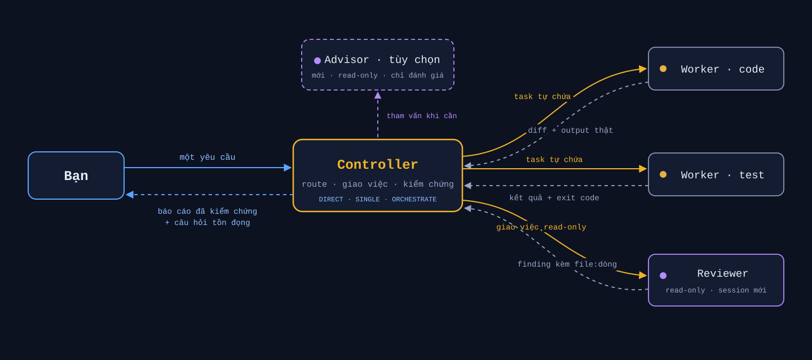

<p align="center">
  
</p>

<h1 align="center">hod — Herdr Orchestrator Driver</h1>

<p align="center">
  <strong>Một lệnh để bắt đầu. Một controller chịu trách nhiệm. Cả đàn coding agent — có kiểm chứng.</strong>
</p>

<p align="center">
  <a href="README.md">English</a> · <b>Tiếng Việt</b>
</p>

<p align="center">
  <!-- Ẩn badge CI trong thời gian tạm dừng validation tự động. -->
  <a href="https://github.com/hapo-nghialuu/hod/releases"></a>
  
  <a href="LICENSE"></a>
</p>

<p align="center">
  <a href="#-bắt-đầu"><b>🚀 Bắt đầu</b></a> ·
  <a href="#đây-là-gì">Đây là gì?</a> ·
  <a href="#cách-hoạt-động">Cách hoạt động</a> ·
  <a href="#lệnh-hod">Lệnh</a> ·
  <a href="#phụ-lục">Phụ lục</a>
</p>

---

# 🚀 Bắt đầu

**Ba bước. Khoảng năm phút.**

### 1 · Cần có trước

macOS hoặc Linux, cộng thêm:

| Cần | Lấy ở đâu |
| --- | --- |
| [Herdr](https://herdr.dev/) | `brew install herdr` |
| `git`, `jq` | `brew install jq` (git thường có sẵn) |
| Một agent CLI đã đăng nhập | `claude`, `codex`, hoặc `grok` — một cái là đủ |

### 2 · Cài `hod`

```bash
curl -fsSL https://raw.githubusercontent.com/hapo-nghialuu/hod/main/install.sh | sh
hod status
```

<details>
<summary>Ghim một bản phát hành thay vì bám <code>main</code> — khuyến nghị cho team</summary>

```bash
curl -fsSL https://raw.githubusercontent.com/hapo-nghialuu/hod/main/install.sh | HOD_REF=v0.1.15 sh
```

</details>

Chỉ vậy là xong: không phải sắp xếp lại thư mục, không thủ tục theo từng dự
án. `hod` clone skill về `~/.hod/skill/`, đặt lệnh `hod` vào `~/.local/bin/`,
và tạo adapter global để mọi agent CLI đều tìm thấy. Muốn gắn riêng một dự án:
`hod install --project /đường/dẫn/repo`.

Nên làm tiếp: `herdr integration install claude` (và `codex`) để sidebar báo
trạng thái agent chính xác thay vì đoán.

### 3 · Chạy task điều phối đầu tiên

```bash
cd /đường/dẫn/dự-án
herdr                 # Herdr mở lên
claude                # trong pane — đây là controller của bạn
```

Dán câu này, nhớ gọi tên **Herdr** và **herdr-orchestrator** — thiếu một trong
hai thì skill nằm im:

```text
Dùng Herdr và skill herdr-orchestrator để <một việc nhỏ kiểm chứng được>.
Một writer, một reviewer read-only. Không commit, không push.
Trả về file đã đổi, kết quả test thật, và câu hỏi tồn đọng.
```

<details>
<summary>Các cách gọi khác, theo từng CLI</summary>

| CLI | Cách gọi | Ghi chú |
| --- | --- | --- |
| Claude Code | `/herdr-orchestrator` | Slash command; nạp skill trước, rồi mới mô tả việc |
| Codex | `$herdr-orchestrator` | Cùng ý tưởng, dùng tiền tố của Codex |
| Grok Build | yêu cầu thường | Nói rõ là muốn dùng skill `herdr-orchestrator` |
| Mọi CLI | gọi tên trong câu yêu cầu | Ví dụ ở trên — chạy được ở đâu cũng được, không cần tiền tố |

Nạp skill bằng lệnh rồi mô tả việc, hay viết thẳng vào câu yêu cầu — hai cách
về cùng một chỗ. Dạng tiền tố đỡ phải nhắc lại tên skill; dạng viết thẳng thì
đỡ phải nhớ thêm cú pháp. Kiểu nào thì bản thân task vẫn cần nêu rõ kết quả
mong muốn, vai trò, và bằng chứng bạn muốn nhận lại.

</details>

> ✅ **Chạy đúng khi sidebar Herdr mọc pane mới.**
> Chấm trạng thái: 🟡 đang làm (kệ nó) · 🔴 đang chờ bạn (đọc pane đó, nhưng
> trả lời trong pane của controller) · 🟢 rảnh.
> Muốn thoát ra thì `ctrl+b` rồi `q`; không có gì chết cả.

**Muốn chi tiết hơn?** [Quickstart — 5 cấp độ](docs/quickstart.md) ·
[Getting started — 6 bước có checkpoint](docs/getting-started.md) ·
[Troubleshooting](docs/troubleshooting.md)

---

## Đây là gì?

Chạy nhiều AI coding agent cùng lúc thì dễ. Quản chúng mới khó — bạn có cả
chục tab terminal, không biết con nào đang chờ mình, và cũng không biết chữ
"xong" của nó có nghĩa là code chạy được hay không.

`hod` cho bạn **một agent duy nhất để nói chuyện**. Bạn mô tả điều mình muốn;
nó lập kế hoạch, chia việc cho các agent khác trong pane
[Herdr](https://herdr.dev/) riêng, đối chiếu kết quả với diff thật và lần chạy
test thật, rồi quay lại với một câu trả lời — kèm danh sách những gì chỉ bạn
mới quyết được.

<p align="center">
  
</p>

Bạn không phải quản worker. Không phải chạy theo từng pane. Bạn nhận bằng
chứng, không phải lời hứa.

**Hợp với bạn nếu** bạn chạy nhiều hơn một coding agent, muốn có thêm một
cặp mắt soi code do AI sinh ra, hoặc cần chia việc qua nhiều dự án mà không
mất dấu ai đã sửa gì.

> Dự án cộng đồng độc lập. Không liên kết với Herdr, OpenAI, Anthropic, hay xAI.

## Bên trong có gì

`hod` gồm hai phần được tách bạch có chủ đích:

| Phần | Là gì | Làm gì |
| --- | --- | --- |
| **Skill** | Bản contract Markdown (`SKILL.md` + `references/`) | Bộ não: luật ủy quyền, kỷ luật vòng đời, kiểm chứng, ranh giới an toàn. LLM đọc và thi hành bằng phán đoán |
| **CLI `hod`** | Một binary bash duy nhất | Đôi tay: cài skill ở bất kỳ đâu, chẩn đoán setup, quản lý profile quyền theo vai, và trong orchestration chỉ áp dụng guard topology mang tính máy móc. Không bao giờ tự quyết định planning, routing, hay authority |

Việc tách đôi này là cố ý: *skill/controller quyết định planning, routing, và
authority; CLI chỉ làm cơ chế dispatch máy móc, xác định được* — không bên nào
giả vờ làm việc của bên kia.

## Cách hoạt động

1. **Bạn chỉ nói chuyện với một agent.** Trong pane Herdr, gọi tên skill một
   cách tường minh:

   ```text
   Dùng Herdr và skill herdr-orchestrator để làm endpoint health.
   Một writer, một reviewer read-only. Không commit, không push.
   Trả về file đã đổi, kết quả test, và câu hỏi tồn đọng.
   ```

2. **Controller chạy preflight** — từ chối hành động nếu không ở trong pane
   do Herdr quản lý (`HERDR_ENV=1`), server không tương thích, hoặc bộ lệnh
   cài đặt không khớp `--help`. Với child, `hod dispatch` bind và đọc lại
   controller, split, bind và đọc lại child, start, refresh và đọc lại, rồi mới
   gửi prompt direct-user. Mọi thứ mơ hồ → dừng lại (fail-closed).

3. **Worker được nói chuyện như thể chính bạn viết prompt.** Tin nhắn Herdr
   không có trường người gửi, nên từ ngữ là thứ duy nhất có thể làm lộ cơ chế
   định tuyến — contract cấm hoàn toàn kiểu "bạn là sub-agent, báo cáo lại
   cấp trên".

4. **Không tin lời khai, chỉ tin bằng chứng.** Trạng thái `done` của agent
   chỉ là suy đoán từ màn hình, không phải bằng chứng. Controller đọc diff
   thật, chạy check trong pane với sentinel theo từng lần chạy (chữ `passed`
   cũ trên màn hình không bao giờ bị nhận nhầm là kết quả mới), và đưa thay
   đổi đáng kể cho một reviewer độc lập chạy session mới.

5. **Báo cáo kết thúc bằng những gì còn cần bạn quyết** — câu hỏi tồn đọng
   của từng worker được thu hoạch và ghi rõ nguồn, không bao giờ bị bản tóm
   tắt nuốt mất.

**Dấu hiệu chạy đúng: sidebar Herdr mọc pane mới.** Nếu chỉ thấy dòng
"background agents" mà sidebar đứng im — CLI đang dùng sub-agent nội bộ chứ
không phải điều phối qua Herdr; hãy nhắc lại yêu cầu kèm tên Herdr và skill.

## Adaptive coordinator (opt-in)

Workflow mặc định không đổi trừ khi bạn nói rõ muốn adaptive coordinator hoặc
coordinator kèm advisor. Adaptive mode chọn route nhỏ nhất phù hợp với request:

| Base mode | Dùng cho | Điều xảy ra |
| --- | --- | --- |
| `DIRECT` | Câu hỏi, giải thích, đọc/kiểm tra read-only, và status | Fast path không plan; không worker hay checkpoint |
| `SINGLE` | Một kết quả có thể đảo ngược, một owner hẹp | Một task packet và bằng chứng máy móc cho thay đổi repo |
| `ORCHESTRATE` | Nhiều writer, dependency, phase, repo, hoặc blast radius lớn | Working plan, ownership tường minh, và điều phối theo thứ tự |

`CONSULT` và `ASK_USER` là overlay, không phải mode bổ sung. Trong adaptive
mode, consult mở một advisor độc lập trong session mới khi bạn yêu cầu tường
minh hoặc khi một trigger kỹ thuật đủ điều kiện xảy ra; câu hỏi về authority,
permission, chi phí, hay hành động hướng ra ngoài sẽ dừng để bạn quyết. Bạn
phải chọn rõ một advisor trong `Fable`, `GPT-5.6 Sol`, hoặc `Opus` trước khi
dispatch — advisor chỉ đánh giá, không phê duyệt. Nếu advisor đã chọn không có,
hãy hold và hỏi lại; không bao giờ default hay substitute. Mọi thay đổi repo
vẫn có E0 evidence receipt máy móc trước acceptance, và mọi tripwire đều `HOLD`
trước khi route lại.

Xem [reference adaptive coordinator](references/coordinator-advisor.md) để đọc
đủ protocol và [ví dụ sử dụng](docs/usage-guide.md).

## Lệnh `hod`

| Lệnh | Tác dụng |
| --- | --- |
| `hod install` | Clone/cập nhật skill và tạo adapter global (`~/.claude/skills/`, `~/.agents/skills/`) |
| `hod install --project <path>` | Gắn một dự án — vị trí bất kỳ, tên thư mục bất kỳ. Git là tuỳ chọn; ngoài repository thì bước ghi `.git/info/exclude` được bỏ qua. Đồng thời ghi khối nhắc (`--no-memo` để bỏ qua) |
| `hod install --ref <tag>` | Ghim skill vào một tag phát hành |
| `hod status` | Một dòng ✓/✗ cho từng mục: công cụ, agent CLI, checkout, adapter, PATH. Exit 0 khi khỏe |
| `hod doctor` | Như `status` cộng thêm lệnh khắc phục, kiểm tra adapter, chế độ checkout (branch/pinned), trạng thái integration |
| `hod update` | Fast-forward skill; checkout đang pin sẽ nhảy tới tag mới nhất. Từ chối khi cây có sửa đổi |
| `hod settings list` | Liệt kê profile Claude, cờ Codex tương đương + lệnh khởi động dán được ngay |
| `hod settings install [--role <r>] [--force]` | Ghi profile theo vai vào `.claude/` của dự án |
| `hod dispatch start --name <unique> --role <r> --task <slug> --run <id> --kind <kind> --cwd <absolute> --direction <right\|down> --timeout <ms> -- ...` | Start child có guard từ prompt direct-user qua stdin; trả JSON receipt |
| `hod dispatch prompt --pane <id> --kind <kind> --task <slug> --run <id> --timeout <ms>` | Refresh và validate child trước khi redirect prompt direct-user qua stdin |
| `hod ui [--project <path>] [--port <0-65535>] [--no-open]` | Mở console web HOD cục bộ (Node.js 20+) |
| `hod uninstall [--purge]` | Chỉ xóa adapter trỏ về `~/.hod/skill` và cắt khối nhắc; không bao giờ đụng file lạ |

Các kiểm tra chẩn đoán Herdr vẫn **chỉ đọc** (`herdr status`,
`herdr integration status`). `hod dispatch` là workflow HOD được hỗ trợ để
start và prompt child; nó chỉ sở hữu topology guard mang tính máy móc. Planning,
routing, và authority vẫn thuộc controller và bạn. `hod` không cài integration.
UI cục bộ chỉ đổi các setting đã công bố sau khi bạn xác nhận rõ ràng — quyền
với session vẫn thuộc về bạn và controller.

## Guarded topology dispatch

Với child cần xuất hiện trong topology HOD, dùng `hod dispatch start`; prompt
direct-user không rỗng phải đi qua stdin. Dạng public là:

```text
hod dispatch start --name <unique> --role worker|advisor|reviewer|tester \
  --task <safe-slug> --run <safe-id> --kind <kind> --cwd <absolute> \
  --direction right|down --timeout <ms> \
  [--advisor-choice fable|gpt-5.6-sol|opus --advisor-model <same>] -- [native args...]
```

Ví dụ:

```bash
project_cwd="$(pwd -P)"
printf '%s\n' 'Implement health endpoint và trả về file đã đổi cùng kết quả test.' |
  hod dispatch start --name health-worker --role worker \
    --task health-endpoint --run run-demo-001 --kind claude \
    --cwd "$project_cwd" --direction right --timeout 120000 -- \
    --settings .claude/settings.impl.json
```

Khi thành công, stdout có JSON receipt gồm `pane_id`, `name`, `role`,
`relation`, `task`, và `run`. Mapping relation máy móc là
`worker=delegate`, `advisor=consult`, và `reviewer=tester=verify`.
Advisor start bắt buộc có `--advisor-choice` canonical và
`--advisor-model` trùng khớp, cùng đúng một native `-m` hoặc `--model` tương
ứng; `fable`/`opus` bắt buộc `--kind claude`, còn `gpt-5.6-sol` bắt buộc
`--kind codex`; receipt ghi lựa chọn, `requested_model`, và đánh dấu runtime
model chưa được Herdr xác minh. Nếu user chưa chọn advisor, phải
`HOLD + ASK_USER`. Start/get/prompt Herdr 0.8 thành công chỉ được công nhận khi
name, pane, kind, workspace, terminal identity, readiness boolean, status hợp
lệ và `state_change_seq` đúng; stdin có NUL bị reject, không truncate, còn
prompt lớn hơn 131072 byte bị reject trước mutation. `--timeout` là một
wall-clock deadline chung xuyên suốt capability probe, lock, metadata,
lifecycle call và delivery; cleanup khi lỗi có hard cap riêng ba giây. Codex có
Workspace, terminal, kind và session của controller phải giữ nguyên chính xác
qua mutation; pane revision được phép tăng nhưng không được lùi. Codex có
thể chỉ trả agent-session sau prompt đầu: start bind terminal cùng sequence
không đổi, đợi đúng prompt surface của Codex và gửi theo unique agent name.
Receipt lần đầu chưa có session chỉ hợp lệ ở `working` hoặc `blocked`. Mọi
redirect sau đó bắt buộc authoritative read có session không rỗng, không đổi.
Start đọc controller trước: pane chưa có HOD token mới được bootstrap, controller
có sẵn phải có đúng `hod_run`, còn token child/partial/invalid bị reject trước
report, split, start, prompt. Prompt reject advisor, pane đang working,
agent authoritative đang working hoặc chưa ready trước mọi report metadata.

Muốn redirect child đã có, cũng gửi prompt direct-user mới qua stdin:

```bash
printf '%s\n' 'Tiếp tục task và báo cáo kiểm chứng mới.' |
  hod dispatch prompt --pane "$child_pane_id" --task health-follow-up \
    --kind claude --run run-demo-001 --timeout 120000
```

`hod dispatch prompt` refresh và validate controller cùng child trước khi
redirect, gồm cả agent-get authoritative để từ chối child đang `working`.
Advisor redirect bị từ chối vì mỗi consult phải là một start mới. Raw `herdr
pane split`, `herdr agent start`, và `herdr agent prompt` vẫn hợp lệ cho công
việc chủ động không tracking; các pane đó có thể hiện `UNMAPPED` và nằm ngoài
đảm bảo lifecycle của HOD. Không trộn raw mutation với HOD dispatch đang chạy
trên cùng một pane.
Herdr cũ thiếu đúng capability bắt buộc sẽ fail trước split, không có fallback.
Sau khi update HOD, phải restart hoặc reload controller session chạy lâu để
nạp instruction mới — HOD không thể retrofit instruction đã nạp trong session
đang chạy.

Các dispatch của cùng coordinator được serialize. Redirect bind expected kind,
terminal identity và agent-session identity không đổi; lỗi bind pre-start chỉ
đóng pane vừa split sau readback cleanup chính xác. Thay đổi đã nhìn thấy ở
readback đó làm HOD để pane mở và fail-closed. Herdr 0.8 không có owner-CAS cho
lệnh close hoặc metadata write kế tiếp, nên mutation bên ngoài trong khoảng
cuối này vẫn là race; không trộn raw lifecycle operation với HOD dispatch đang
chạy. Lỗi pre-delivery rollback metadata đã stage khi Herdr chấp nhận;
lifecycle attempt mơ hồ không được auto-retry. HOD không chủ ý đóng pane chưa
chứng minh ownership hoặc đã start agent.

## Console UI cục bộ của HOD

Đây là console web tuỳ chọn để xem workspace và agent Herdr mà không phải tự
quản lý pane:

```bash
hod ui [--project <path>] [--port <0-65535>] [--no-open]
```

Muốn xem observer runtime-only, không phụ thuộc thư mục hiện tại, dùng:

```bash
hod start [--port <0-65535>] [--no-open]
```

`hod start --project <path>` bị từ chối; observer bỏ qua thư mục hiện tại.
Settings chọn project/space Herdr đang chạy bằng workspace ID bất định danh;
server tự resolve checkout hiện tại theo nguồn authoritative và không bao giờ
đưa đường dẫn project ra browser. `hod ui` và `hod ui --project` vẫn giữ nguyên
hành vi project-scoped hiện có.

UI hỗ trợ macOS và Linux, cần Node.js 20 trở lên. Port mặc định là `0` để hệ
điều hành tự chọn port trống; macOS dùng `open`, Linux dùng `xdg-open`. Với
`--no-open`, hoặc khi lệnh mở trình duyệt thất bại, `hod ui` in recovery URL.
Fragment `#token` dùng một lần là dữ liệu nhạy cảm: không chia sẻ hay ghi log;
browser đổi nó thành cookie cục bộ `HttpOnly; SameSite=Strict` rồi xóa fragment.

Console chỉ local (`127.0.0.1`, kiểm tra chặt `Host`/`Origin`, không có remote/LAN).
Runtime theo dõi nhiều workspace/space và agent bằng polling có giới hạn, không
phải subscription Herdr event-driven; Herdr lỗi là nonfatal và reconnect xóa
state stale. Dashboard tính tổng toàn bộ space cho spaces, agents, working,
blocked, idle và done, không phụ thuộc space đang chọn. Transcript chỉ là tail
16 MiB UTF-8 trong RAM của pane đang chọn, chỉ đọc, không persistent,
byte-exact, append-only hay audit log. Với `hod start`, Settings có thể cài ba
profile role HOD đã công bố cho project live đang chọn và cập nhật đúng mười key
Herdr global có kiểu sau khi xác nhận. Project root thiếu hoặc mơ hồ sẽ fail
closed; key lạ/bí mật không lộ ra. Runtime-only vẫn không có hành động điều
khiển agent.

Ma trận setting, confirmation/force, giới hạn ghi và residual boundary khi cùng
user swap path được mô tả đầy đủ ở [Console UI HOD cục bộ](docs/usage-guide.md#local-hod-ui-console).

## Khối nhắc

Model hay quên giữa chừng rằng có Herdr để chia việc. Khi cài vào dự án, hod
ghi vài dòng vào `CLAUDE.md` và `AGENTS.md` — file mà agent CLI đọc mỗi lượt —
để nhắc controller giao việc thay vì tự làm:

```markdown
<!-- hod:begin — managed by hod; edits inside this block are overwritten -->
## Herdr orchestration
...
<!-- hod:end -->
```

Cặp mốc khiến việc chạy lại an toàn: chỉ phần giữa 2 mốc bị thay, mọi thứ bạn
viết bên ngoài giữ nguyên từng byte, và `hod uninstall --project` cắt khối đó
đi. hod từ chối động vào file có mốc lệch hoặc file là symlink.

Hai file này thường thuộc về repo nên khối nhắc sẽ hiện trong `git status` —
**xem diff rồi tự quyết có commit hay không**; hod không bao giờ commit. Muốn
bỏ hẳn thì dùng `hod install --project <path> --no-memo`.

Khối nhắc có hai biến thể. Bản mặc định nhắc agent điều phối khi bạn nhờ chia
việc cho nhiều agent. `--memo-strict` tuyên bố **dự án Herdr-first**: khi ở
trong pane Herdr, mọi task implementation, sửa bug, hay nhiều bước đều đi qua
worker Herdr; controller chỉ làm trực tiếp khi trả lời câu hỏi hoặc bạn nhờ
sửa nhỏ tại chỗ. Ở ngoài pane Herdr, preference này không bao giờ chặn việc —
agent cứ làm bình thường, chỉ nhắc một câu rằng dự án ưu tiên Herdr.
Chạy lại `hod install --project` trần giữ nguyên biến thể dự án đang có —
đồng đội không thể vô tình hạ cấp — còn `--memo-default` là cách hạ cấp
tường minh.

Khối nhắc **không** ép skill chạy: muốn kích hoạt vẫn phải gọi tên Herdr hoặc
tên skill trong lời nhờ. Nó nhắc, không ghi đè.

## Profile theo vai: luật do harness cưỡng chế

Vai trò viết trong prompt là lời khuyên. Vai trò cài thành profile quyền là
ranh giới agent **không thể** vượt qua, kể cả khi bị yêu cầu:

Claude cưỡng chế profile bằng file settings. Worker Codex dùng cờ sandbox và
approval native; ánh xạ cùng các chỗ vênh trung thực nằm trong [Role
Boundaries](references/role-boundaries.md).

```bash
hod settings install     # ghi .claude/settings.<vai>.json + tự thêm git exclude (nếu là repo Git)
```

| Vai | Chế độ | Bị chặn | Ý nghĩa |
| --- | --- | --- | --- |
| `controller` | `default` | `Edit` `Write` `NotebookEdit` `Agent` + `git push/merge` | Lập kế hoạch và giao việc. Không sửa file, và không spawn sub-agent nội bộ để đi đường tắt qua Herdr |
| `impl` | `acceptEdits` | `git push` `merge` `reset --hard` `tag` | Code thoải mái, không bị hỏi từng file; không phát tán ra ngoài |
| `reviewer` | `default` | tool sửa file + `Agent` + lệnh git ghi + `rm` | Read-only thật sự, và tự mắt mình đọc diff |

Chặn cả một tool là kín tuyệt đối — harness gỡ tool khỏi context của model.
Chặn theo tiền tố shell thì không: nó chỉ khớp token đầu tiên, nên
`Bash(pytest:*)` vẫn để hở `python -m pytest`. Vì vậy các profile này dựa vào
việc chặn tool, còn kỷ luật dòng lệnh thì để cho prompt và bằng chứng mà
controller đọc lại.

`Agent` là luật giữ cho việc điều phối trung thực. Không có nó, controller âm
thầm quay về dùng sub-agent của chính CLI: sidebar không hiện pane nào, bạn
không mở hay trả lời được, và toàn bộ transcript của chúng đổ vào context
controller cho tới khi phiên chết vì hết context.

Mỗi profile cũng tự khai `defaultMode`, vì file `--settings` **thắng**
`~/.claude/settings.json` của bạn. Điều này quan trọng nếu máy bạn đang dùng
`dontAsk`: chế độ đó tự động từ chối mọi tool không có trong
`permissions.allow`, **và** chặn `AskUserQuestion` kể cả khi đã allow — nên
worker mất `Bash` và không còn báo được là mình đang kẹt. Pane im lặng, còn
controller thì chờ mãi. Đừng bao giờ để `dontAsk` trong profile theo vai.

```bash
printf '%s\n' 'Implement thay đổi được yêu cầu và trả về bằng chứng.' |
  hod dispatch start --name impl-worker --role worker --task requested-change \
    --run run-demo-001 --kind claude --cwd "$(pwd -P)" \
    --direction right --timeout 120000 -- \
    --settings .claude/settings.impl.json

printf '%s\n' 'Review diff hiện tại read-only và trả về findings kèm path-line.' |
  hod dispatch start --name read-only-reviewer --role reviewer --task review-change \
    --run run-demo-001 --kind claude --cwd "$(pwd -P)" \
    --direction right --timeout 120000 -- \
    --settings .claude/settings.reviewer.json
```

Đây là guarded dispatch mới; không truyền `--continue` hoặc `--resume` cho
reviewer độc lập.

Hai luật được chứng minh bằng test thật, không phải lý thuyết:

- **Không bao giờ kết hợp profile với native permission-bypass flag hoặc
  mode** — các dạng như `--dangerously-skip-permissions` hoặc
  `--permission-mode bypassPermissions` ghi đè luật `deny`. `hod dispatch
  start` từ chối các dạng và giá trị bypass trực tiếp trong native argv cho
  mọi role trước mutation. HOD không đọc nội dung file settings, profile,
  config được tham chiếu, custom sandbox profile hoặc cấu hình CLI từ môi
  trường; chỉ truyền input đã tin cậy.
- **Boundary role dùng positive allowlist cho native argument.** Start advisor,
  reviewer và tester chỉ nhận model/effort cùng các dạng boundary read-only đã
  document. Root subcommand, native cwd/system-prompt, inline Claude
  settings/tool grant, sandbox không read-only, cùng Codex config/profile hoặc
  approval override tùy ý đều fail trước mutation. Dùng Claude settings dạng
  file, Codex canonical `-s read-only -c features.multi_agent=false`, hoặc Grok
  `--sandbox read-only` kèm deny rule.
- **Reviewer không bao giờ là session được khôi phục.** Các dạng resume, fork,
  PR, teleport và cloud-session khôi phục đúng cái thiên kiến mà review độc
  lập sinh ra để loại bỏ, nên guarded boundary role từ chối chúng.

Profile chỉ chứa ranh giới quyền — không bao giờ chứa credential. Claude Code
gộp profile lên các settings đã nạp sẵn, nên token, endpoint và hooks được kế
thừa nguyên vẹn. (Codex và Grok cưỡng chế vai bằng cờ riêng — sandbox/approval
và allow/deny; xem bảng vai trò trong [`SKILL.md`](SKILL.md).)

## Skill cam kết những gì

Bản contract mà controller vận hành theo, cô đọng lại:

- **Giọng người dùng trực tiếp** — worker tin rằng nó đang nói chuyện với
  bạn; cơ chế định tuyến không bao giờ lộ vào prompt.
- **Không bịa thẩm quyền của bạn** — không phê duyệt tự chế; phạm vi, rủi
  ro, chi phí, mọi thứ hướng ra ngoài đều quay về hỏi bạn. Không bao giờ dùng
  việc ủy quyền để lấy quyền mà bạn chưa cấp.
- **Fail-closed** — bộ lệnh lạ, JSON hỏng, đích mơ hồ: dừng và báo cáo,
  không bao giờ đoán pane ID hay cú pháp.
- **Bằng chứng trên lời khai** — `done` bằng miệng không phải hoàn thành;
  diff, output check mới có sentinel, và review độc lập mới là.
- **Một file, một người viết** — worker song song sở hữu vùng file tách
  biệt; manifest dùng chung có một integration owner; conflict giao cho một
  integrator, không bao giờ do tay controller.
- **Dọn dẹp bảo thủ** — pane và worktree do task tạo được giữ lại cho bạn
  kiểm tra, tới khi bạn cho phép xóa.

Mọi luật bất biến nằm ngay trong [`SKILL.md`](SKILL.md) — nạp trọn vẹn mỗi khi
skill kích hoạt — cộng các reference chỉ nạp khi cần:

| Reference | Nội dung |
| --- | --- |
| [Operations](references/operations.md) | Recipe lệnh, khôi phục prompt stalled, sentinel, task packet, hồi sinh session, checklist tích hợp |
| [Adaptive coordinator](references/coordinator-advisor.md) | Routing opt-in, tripwire, evidence gate, policy advisor, và checkpoint handoff |
| [Portfolio hierarchy](references/portfolio-hierarchy.md) | Một orchestrator, nhiều dự án: tier, policy, state bền vững |
| [Legacy Herdr 0.7.1](references/legacy-herdr-0.7.1.md) | Đường tương thích cho bộ lệnh cũ |

## Mở rộng quy mô

- **Song song không giẫm chân** — việc độc lập đặt vào các Git worktree
  riêng (`herdr worktree create`), mỗi worktree một agent; sở hữu file vẫn
  tách bạch xuyên checkout.
- **Đội trộn nhiều CLI** — `--kind claude|codex|grok` cho từng worker, model
  truyền sau dấu `--` với ID chính xác (`-m gpt-5.6-sol
  -c model_reasoning_effort=max`, `-m grok-4.5`, `--model <id>`).
- **Nhiều dự án, một orchestrator** — chế độ
  [portfolio](docs/portfolio-orchestration.md) (opt-in): mỗi dự án một
  controller riêng, trần ủy quyền cứng hai tầng, và policy file do chính bạn
  viết đặt *ngoài* mọi checkout để không agent nào tự nới quyền của mình.

## Tài liệu

| Tài liệu | Dành cho |
| --- | --- |
| [Quickstart — 5 cấp độ](docs/quickstart.md) | Bắt đầu trong 2 phút; chỉ leo cấp khi thấy chật |
| [Getting started](docs/getting-started.md) | Chi tiết đầy đủ |
| [Console UI HOD cục bộ](docs/usage-guide.md#local-hod-ui-console) | Runtime dashboard, giới hạn transcript, settings và ranh giới bảo mật |
| [Usage guide](docs/usage-guide.md) | Công thức prompt: pipeline, đội song song, điều hướng, chọn model |
| [Portfolio orchestration](docs/portfolio-orchestration.md) | Quản nhiều dự án với một orchestrator |
| [Troubleshooting](docs/troubleshooting.md) | Adapter, preflight, lệch capability |

## Cấu trúc repo

```text
herdr-orchestrator/
├── SKILL.md                    # điểm vào cho agent (luôn được nạp)
├── references/                 # contract chi tiết (nạp khi cần)
├── bin/hod                     # CLI — install, doctor, settings, update
├── install.sh                  # bootstrap curl | sh (HOD_REF để ghim version)
├── scripts/
│   ├── test-hod.sh             # 522 test hermetic cho CLI
│   └── validate.sh             # syntax + frontmatter + link markdown
├── templates/                  # policy mẫu + profile quyền theo vai
├── docs/                       # tài liệu cho người
├── assets/                     # hình ảnh README
└── .github/workflows/          # Validation thủ công trên Ubuntu + macOS; tạm dừng auto-run
```

## Những gì nó KHÔNG làm

- Không cài, không đăng nhập, không trả tiền cho agent CLI hộ bạn.
- Không cấp quyền mà bạn chưa từng cấp.
- Không ép mọi task thành multi-agent — việc nhỏ vẫn một agent.
- Không tự quyết định planning, routing, hay authority; các quyết định này vẫn
  thuộc controller và bạn.
- Không coi trạng thái `done` của agent là bằng chứng đúng đắn.
- Không commit, merge, push, publish, hay xóa gì khi chưa có thẩm quyền từ bạn.

## Giới hạn đã biết

- Cưỡng chế vai bằng settings profile mới phủ Claude Code; Codex và Grok dùng
  cờ native riêng (đã có tài liệu, chưa có template).
- Nhận diện capability bằng cách đọc `--help` — bản Herdr tương lai đổi câu
  chữ sẽ khiến skill dừng an toàn (fail-closed) cho tới khi được cập nhật.
- Herdr đang pre-1.0; dự án bám bản stable hiện tại (đã kiểm chứng với
  0.7.5), kèm đường tương thích best-effort cho 0.7.1.
- Windows native chưa được kiểm thử.

## Phụ lục

<details>
<summary><b>A. Thuật ngữ — các từ dự án này dùng</b></summary>

| Thuật ngữ | Nghĩa |
| --- | --- |
| **Herdr** | Terminal multiplexer mà mọi thứ chạy bên trong. Nó cho mỗi agent một pane thật, nhận diện trạng thái, và mở API điều khiển. Không thuộc dự án này |
| **Pane** | Một ô terminal trong Herdr. Mỗi pane một agent tương tác |
| **Workspace** | Một nhóm tab và pane, thường mỗi dự án một cái |
| **Controller** | Agent duy nhất bạn nói chuyện. Lập kế hoạch, giao việc, kiểm chứng, báo cáo. Không viết code |
| **Worker** | Agent mà controller thuê cho một task cụ thể. Khởi động với context trống |
| **Reviewer** | Worker read-only soi diff. Luôn là session mới — không bao giờ là agent đã viết code đó |
| **Kind** | Agent thuộc CLI nào: `claude`, `codex`, `grok`, … |
| **Adapter** | Symlink giúp CLI nhìn thấy skill (`~/.claude/skills/herdr-orchestrator`) |
| **Profile** | File settings gỡ bớt tool của worker, cưỡng chế vai ngay ở tầng harness |
| **Sentinel** | Token duy nhất in ra sau mỗi lệnh, để chữ cũ trên màn hình không bị nhầm là kết quả mới |
| **Ledger** | Sổ nội bộ của controller: ai sở hữu file nào, worker nào đang ở trạng thái gì |
| **Preflight** | Các kiểm tra controller chạy trước khi đụng vào gì: đúng môi trường, server tương thích, lệnh đã biết |

</details>

<details>
<summary><b>B. Bảng tra lệnh nhanh</b></summary>

**Cài đặt và sức khỏe hệ thống**

```bash
hod status                         # mọi thứ đã nối đúng chưa?
hod doctor                         # như trên, kèm cách sửa từng lỗi
hod update                         # kéo skill mới nhất (hoặc tag mới nhất nếu đang pin)
hod install --project <path>       # gắn một dự án (+ khối nhắc)
hod install --project <path> --no-memo   # gắn mà không đụng CLAUDE.md
hod settings install               # ghi profile theo vai vào dự án
hod uninstall [--purge]            # chỉ gỡ link do hod quản lý
```

**Herdr, dùng hằng ngày**

```bash
herdr                              # mở hoặc gắn lại phiên
herdr agent list                   # mọi agent đang sống và trạng thái
herdr worktree create --cwd <repo> --branch <tên> --no-focus
herdr integration status           # trạng thái agent có đáng tin không?
```

Thoát ra bằng `ctrl+b` rồi `q`. Không có gì dừng chạy.

**Tự tay khởi động child** (bình thường controller làm hộ bạn)

```bash
printf '%s\n' 'Implement task được yêu cầu và trả về file đổi cùng các check.' |
  hod dispatch start --name impl-worker --role worker --task task-slug \
    --run run-demo-001 --kind claude --cwd "$(pwd -P)" \
    --direction right --timeout 120000 -- \
    --settings .claude/settings.impl.json
```

</details>

<details>
<summary><b>C. Các mẫu prompt hiệu quả</b></summary>

**Một task, có kiểm chứng** — mặc định dùng hằng ngày:

```text
Dùng Herdr và skill herdr-orchestrator để <kết quả mong muốn>.
Một writer, một reviewer read-only. Không commit, không push.
Trả về file đã đổi, kết quả test thật, và câu hỏi tồn đọng.
```

**Coordinator-only nghiêm ngặt** — khi muốn controller không đụng gì:

```text
Chạy coordinator-only: không tự tạo hay sửa file nào. Giao mọi thay đổi cho
worker, kiểm chứng diff và các check của nó, và hỏi tôi khi một thay đổi nhỏ
tới mức không đáng thuê worker.
```

**Chạy song song không giẫm chân** — chỉ khi các phần thực sự không chồng lấn:

```text
Chạy song song, mỗi việc một worker, quyền sở hữu file tách biệt:
- <việc A> sở hữu <đường dẫn>
- <việc B> sở hữu <đường dẫn>
Không ai đụng manifest dùng chung; giao chúng cho một integrator duy nhất.
```

**Chỉ định kind và model tường minh:**

```text
Planner: codex, khởi động với -m <id> -c model_reasoning_effort=max
Implementer: grok, khởi động với -m <id>
Reviewer: claude, khởi động với --settings .claude/settings.reviewer.json
Nếu CLI từ chối model nào, dừng lại hỏi tôi — đừng tự thay bằng model khác.
```

**Chỉnh hướng giữa chừng:**

```text
Ưu tiên bug production, tạm dừng phần tính năng.
```

```text
Test fail trên Ubuntu với output sau: <bằng chứng>. Đọc lại các file liên
quan, chỉ sửa đúng regression đã chứng minh, rồi chạy lại test.
```

</details>

<details>
<summary><b>D. Đọc sidebar</b></summary>

| Chấm | Trạng thái | Nghĩa là gì | Bạn làm gì |
| --- | --- | --- | --- |
| 🟡 | `working` | Agent đang giữa lượt làm việc | Không làm gì. Đừng gửi thêm prompt — Herdr không theo dõi lượt, nó có thể trả lời nhầm yêu cầu |
| 🔴 | `blocked` | Herdr thấy một prompt hỏi/xin phê duyệt | Mở pane đó để **đọc**, rồi trả lời trong pane của **controller** |
| 🔵 | `done` | Xong rồi, chưa ai xem | Không làm gì — controller sẽ thu hoạch. `done` không phải bằng chứng code đúng |
| 🟢 | `idle` | Rảnh, đang chờ | Không làm gì |
| ⚪ | `unknown` | Herdr không phân loại được | Đừng bao giờ mặc định là xong; controller sẽ chạy `herdr agent explain` |

**Phép thử quyết định:** điều phối thật làm **mọc pane mới**. Nếu CLI báo
"background agents" mà sidebar đứng im, nó đang dùng sub-agent nội bộ của
chính nó — không liên quan gì tới Herdr.

</details>

<details>
<summary><b>E. Khi có trục trặc</b></summary>

| Triệu chứng | Nguyên nhân thường gặp | Cách sửa |
| --- | --- | --- |
| Báo "requires a Herdr-managed pane" | Bạn mở CLI ngoài Herdr | Chạy `herdr` trước, rồi mở agent trong pane |
| Skill không kích hoạt | Yêu cầu không gọi tên nó | Nhắc cả "Herdr" lẫn "herdr-orchestrator" |
| Sidebar không hiện trạng thái của một agent | Kind đó chưa có integration | `herdr integration install <kind>` — riêng Grok không có |
| `hod: command not found` | `~/.local/bin` chưa nằm trong `PATH` | Thêm dòng export mà `hod` đã in ra, mở terminal mới |
| Profile theo vai không chặn được gì | Raw start có native permission-bypass flag hoặc mode | Bỏ bypass, hoặc dùng `hod dispatch start`; lệnh này từ chối trước mutation |
| Worker có vẻ đứng im | Có thể nó đang blocked chứ không chết | Đọc pane của nó; nếu đang chờ quyết định, trả lời qua controller |
| `hod update` từ chối chạy | Checkout skill có sửa đổi cục bộ | `cd ~/.hod/skill && git status`, rồi commit, stash, hoặc bỏ |

Bắt đầu bằng `hod doctor` — nó chỉ đúng vấn đề và lệnh khắc phục. Hướng dẫn
đầy đủ: [Troubleshooting](docs/troubleshooting.md). Đừng bao giờ restart server
Herdr để "cho hết lỗi"; làm vậy giết luôn công việc đang chạy.

</details>

<details>
<summary><b>F. Ranh giới an toàn, gom về một chỗ</b></summary>

Những việc **không bao giờ** xảy ra nếu bạn chưa đồng ý:

- Commit, push, merge, tag, publish, deploy
- Xóa file, worktree, nhánh, pane, hay phiên mà task không tạo ra
- Cài integration/plugin cho Herdr, đổi cấu hình, cập nhật Herdr
- Dùng credential, mua bán, hay bất kỳ hành động nào hướng ra ngoài
- Nới quyền cho worker, hay dùng việc ủy quyền để lấy thẩm quyền bạn chưa cấp

Những việc bị chặn **về mặt cấu trúc**, không chỉ là lời khuyên:

- Worker không thể khởi động thêm agent (trừ tầng controller trong portfolio mode, và bị chặn cứng ở hai tầng)
- Profile theo vai gỡ hẳn tool khỏi agent — nó không thể dùng thứ nó không có
- File policy nằm ngoài mọi checkout, nên không agent nào có quyền ghi repo lại tự nới quyền cho mình được
- `hod uninstall` chỉ gỡ symlink trỏ về đúng checkout của chính nó

</details>

## Đóng góp

Hoan nghênh PR nhỏ và tập trung. Đọc [CONTRIBUTING.md](CONTRIBUTING.md) —
tóm tắt: giữ nguyên direct-user contract, mọi khẳng định hành vi phải kèm
bằng chứng từ `--help` đã cài, chạy `./scripts/validate.sh`,
`./scripts/test-hod.sh` trước khi push.
Báo cáo bảo mật qua [SECURITY.md](SECURITY.md).

## Giấy phép

[MIT](LICENSE) © 2026 Luu Trung Nghia
